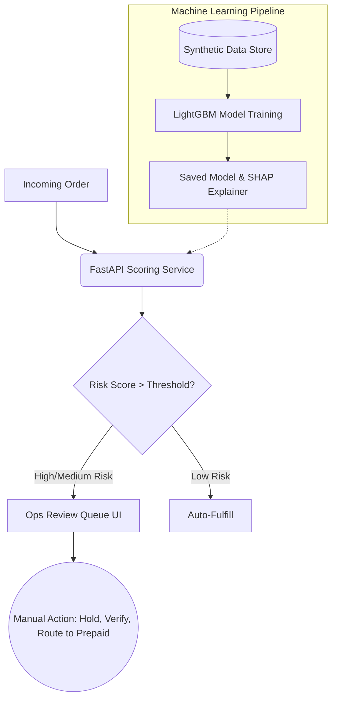

# Return-Risk Scorer for E-Commerce Merchants

**Track:** Razorpay Buildathon — AI Risk Manager

This project provides a machine learning-based scoring system designed to identify non-genuine returns (e.g., wardrobing, velocity abuse, and COD-without-intent) prior to order dispatch. By analyzing historical order patterns and current order characteristics, it assigns a risk score and extracts human-readable SHAP reasons to empower ops teams to intervene (e.g., hold for verification or route to prepaid) before incurring reverse-logistics costs.

## Architecture Overview



## Setup Instructions

### 1. Installation
Ensure you have Python 3.9+ installed.
```bash
pip install -r requirements.txt
```

### 2. Generate Synthetic Data
This creates 20,000 mock orders with injected fraud patterns (wardrobing and velocity abuse).
```bash
python scripts/generate_synthetic_data.py
```

### 3. Train the Model
Trains a LightGBM classifier with class balancing and early stopping.
```bash
python scripts/train_model.py
```

### 4. Evaluate the Model
Outputs precision, recall, PR-AUC, the confusion matrix, and a business cost analysis table.
```bash
python scripts/evaluate_model.py
```

### 5. Start the Services
**Start the FastAPI Backend:**
```bash
uvicorn src.main:app --port 8001
```

**Start the Streamlit Ops UI (in a new terminal):**
```bash
streamlit run ui/app.py
```

## Features
- **Explainability**: Uses SHAP (SHapley Additive exPlanations) to provide the top 3 contributing factors for *why* an order was flagged, making it actionable for ops staff.
- **Human-in-the-Loop**: The model does not auto-cancel; it queues high-risk orders for review, avoiding customer-harm false positives.
- **Defensive Scope**: Explicitly non-offensive. Generates risk scores strictly for internal merchant usage.
